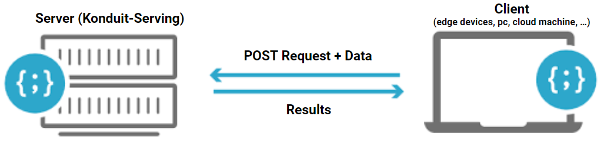
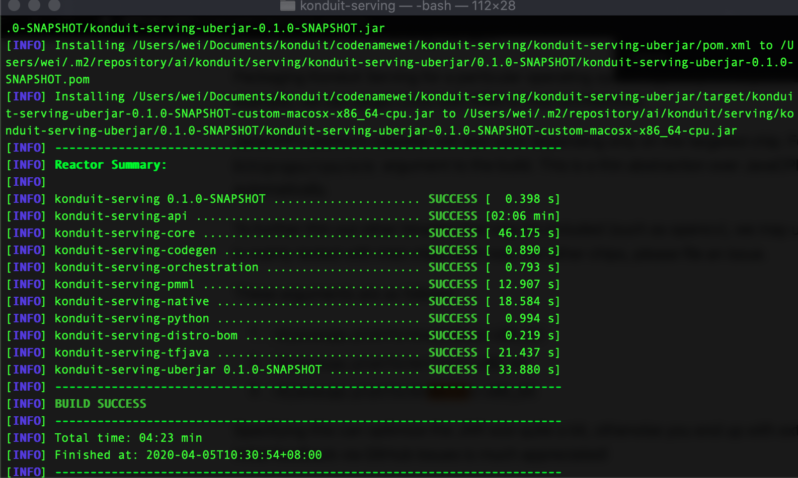
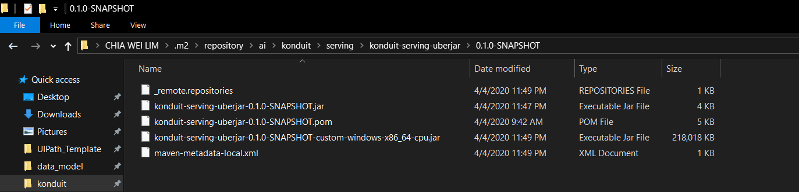
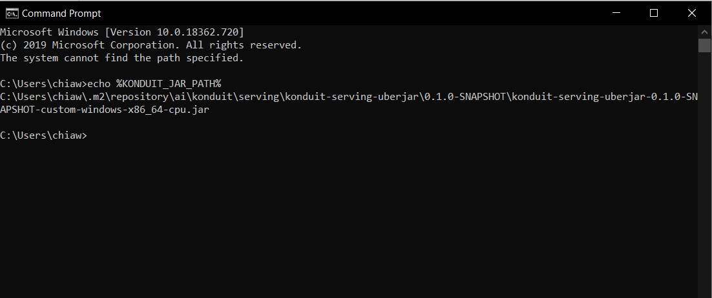
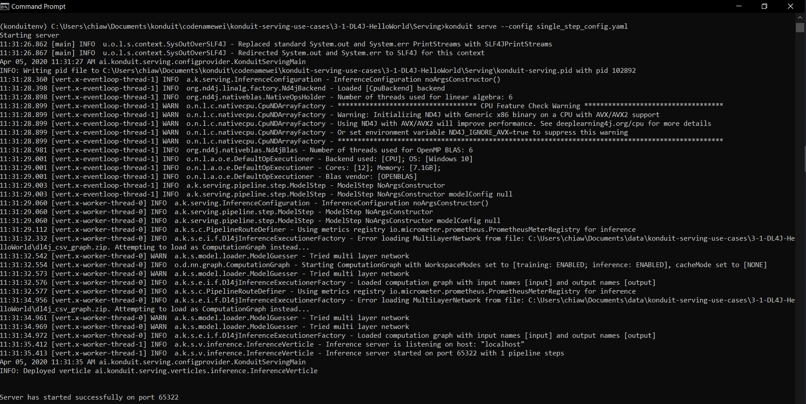
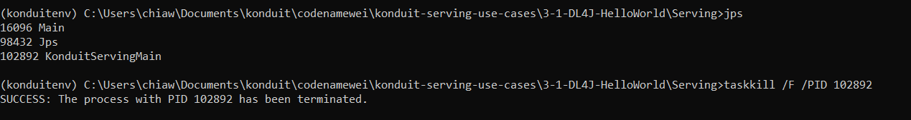

# Konduit Serving Example on Use Cases Basis

Deployment of ML models with [Konduit-Serving](https://github.com/KonduitAI/konduit-serving)

Models are served and run in a server-client architecture model,  
where the models are deployed on the server.
Inference can be called via REST endpoints with Python / Java. 


                
## Konduit-Serving Server Jar
Konduit-Serving is provided in a jar file with all the dependencies.  
- To build the jar files, download / clone the repository from https://github.com/KonduitAI/konduit-serving  
- Go to the root directory through terminal /command prompt 
- Run command  
 `mvn -Ppython -Ppmml -Dchip=cpu -Djavacpp.platform=windows-x86_64 -Puberjar clean install -Dmaven.test.skip=true`

You can get more information of the Konduit-Serving on the readme.md of the repository.  

The most crucial thing is remember to change the platform according to OS you are using  
through the argument `javacpp.platform`.
- **Windows**: Djavacpp.platform=windows-x86_64
- **Linux**: Djavacpp.platform=linux-x86_64
- **Mac**: Djavacpp.platform=macosx-x86_64

Image below shows a successful build of jar file.  

<p align="center">
  
</p>

You will see the jar file in the subdirectory path of .m2 folder.



The jar will consume the most file size compared to other files in the same folder.  

## Python Command Line Interface  

Konduit-Serving provides Python CLI to ease the client running process.  
To get Python Cli, you can install through [pip](https://pypi.org/project/konduit/)  
Alternatively to get the latest version, run`pip install .` in the [python](https://github.com/KonduitAI/konduit-serving/tree/master/python) directory of konduit-serving repository.

## To start a server
To start a server with python client,  
you have to set the path of KONDUIT_JAR_PATH in your system first.  

<p align="center">
  
</p>

### Start a server with python Konduit command
```
konduit serve --config config.yaml
```

<p align="center">
  
</p>

### Start a server with java command
```
java -d64 -cp path\to\konduit-serving-uberjar-0.1.0-SNAPSHOT-custom-windows-x86_64-cpu.jar ai.konduit.serving.configprovider.KonduitServingMain --configPath config.json
```
Note: java command serve json file instad of yaml  

## To stop a server
Windows:  
`taskkill /F /PID pid_number`



Mac:  
`kill -9 pid_number`

## To get logs
Enable `create_logging_endpoints: True` in yaml file.

You can view logs on http://localhost:portNumber/logs/all. Example: http://localhost:65322/logs/all

Alternatively, you can find the main.log log file on the directory where you run client code. 

## How to run / use this repository  
The files are structured in a standalone use case structure.
- To serve a model and get prediction, retrieve the models and data paths through [Google Drive](https://drive.google.com/drive/folders/1v094WDWZrSlPeDHdqQqAoyudsz_tNRPS?usp=sharing) for the very first time.

- Set path in *config.yaml* and *client.py* to the corresponding file paths

- Start the server either with java / python

- Run python client file

### For more information, visit 
- https://serving.konduit.ai/ 
- https://konduit.ai/
